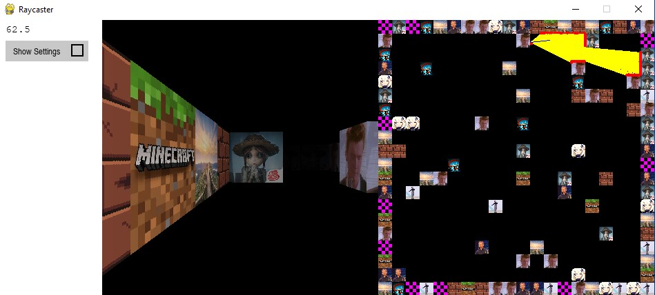

# simple raycasting demo
---
- ## Description
  - a simple raycasting demo
  - made with Pygame
  - what you can learn (although there are no comments)
    - DDA algorithm
    - texture mapping
    - a poorly written GUI class
  - running on replit.com: [https://replit.com/@ZhengIsHere/simple-raycasting-demo](https://replit.com/@ZhengIsHere/simple-raycasting-demo)
  - screenshot:
    - 
---
- ## How To Play
  - <ins> make sure that you already downloaded _**PIL**_ and _**Pygame**_ </ins>
  - run main.py 
  - W, A, S, D to move
  - arrow keys to rotate
  - check the 'wall texture' option to turn on the texture
  - walk around and have fun
---
- ## Notes
  - The left panel is a 2d map, and the right panel is settings
  - To increase fps, uncheck the ‘show settings’ option
    - lazy to write a better GUI
  - If an error occurs, please rerun main.py
  - Running the game for the first time may take some time to load
